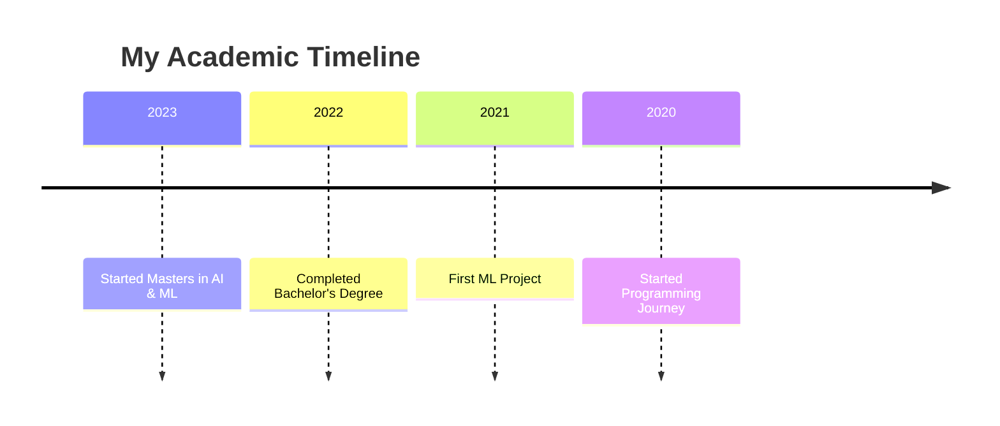

<div align="center">
  


<h3>🎓 Master's student in AI & ML | 💡 LLM Explorer | 🚀 Problem Solver | 🤖 AI Enthusiast</h3>

[](mailto:your.email@gmail.com)
[](https://www.linkedin.com/in/susanta-baidya-03436628a/)
[](https://github.com/Susanta2102)
[](https://www.kaggle.com/susanta21)
[](https://leetcode.com/u/msa23009_iiitl/)
[](https://x.com/SusantBaidya)

</div>

## 🚀 About Me

```python
class AIEngineer:
    def __init__(self):
        self.name = "Susanta"
        self.role = "AI & ML Engineer"
        self.languages = ["Python", "C++", "C"]
        self.interests = ["Deep Learning", "Computer Vision", "LLMs"]
        self.currently_learning = "Transformer Architecture"
        self.fun_fact = "I dream in Python 🐍"

    def say_hi(self):
        print("Thanks for dropping by! Let's build something amazing together!")

me = AIEngineer()
me.say_hi()
```

## 🛠️ Technical Arsenal

<details>
<summary>🐍 Programming Languages</summary>

| Python3 | C | C++ |
|---------|---|-----|
|  |  |  |

</details>

<details>
<summary>🤖 AI/ML Technologies</summary>

| PyTorch | TensorFlow | Scikit-learn | OpenCV | NumPy | Pandas |
|---------|------------|--------------|---------|--------|---------|
|  |  |  |  |  |  |

</details>

<details>
<summary>🗄️ Database & Tools</summary>

| MySQL | PostgreSQL | MongoDB | Docker | Git | AWS |
|-------|------------|----------|---------|-----|-----|
|  |  |  |  |  |  |

</details>

## 📚 Education Journey



## 🏆 GitHub Trophies
[](https://github.com/ryo-ma/github-profile-trophy)

## 📊 GitHub Stats

<div align="center">
  
</div>

<p align="center">
  
</p>

<p align="center">
  
  
</p>

## 🎵 Currently Vibing To
<div align="center">
  
</div>

## 🐍 Contribution Graph
<div align="center">
  
</div>

<div align="center">
  
  <br/>
  
</div>
