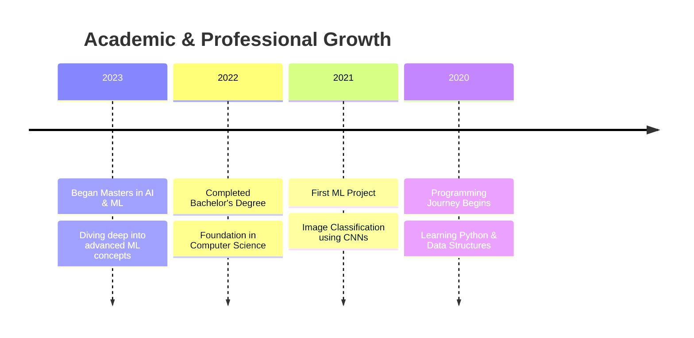

<div align="center">


[](https://git.io/typing-svg)


</div>

## 🚀 Quick Overview

```python
class AIResearcher:
    def __init__(self):
        self.name = "Susanta Baidya"
        self.education = "Master's in AI & ML"
        self.role = "AI Engineer & Researcher"
        self.location = "India"
        self.languages = ["Python", "C++", "C", "SQL"]
        self.interests = ["Deep Learning", "Computer Vision", "NLP", "LLMs"]
        self.current_focus = "Transformer Architecture & MLOps"
        
    def say_hi(self):
        print("🎯 Building the future with AI, one model at a time!")

me = AIResearcher()
me.say_hi()
```

<div align="center">
  
### 🤝 Connect with Me
  
[](mailto:your.email@gmail.com)
[](https://www.linkedin.com/in/susanta-baidya-03436628a/)
[](https://github.com/Susanta2102)
[](https://www.kaggle.com/susanta21)
[](https://leetcode.com/u/msa23009_iiitl/)
[](https://x.com/SusantBaidya)

</div>

## 💻 Tech Stack

<details>
<summary>🔥 Programming & Machine Learning</summary>

| Category | Technologies |
|----------|-------------|
| **Languages** |    |
| **ML/DL** |    |
| **Computer Vision** |   |
| **Data Science** |    |

</details>

<details>
<summary>🛠️ Tools & Platforms</summary>

| Category | Technologies |
|----------|-------------|
| **Development** |    |
| **Cloud & DevOps** |    |
| **Databases** |    |
| **MLOps** |    |

</details>

## 📚 Education & Learning Journey



## 🏆 Achievements & Certifications

<div align="center">
  
[](https://github.com/ryo-ma/github-profile-trophy)

</div>

## 📊 GitHub Analytics

<div align="center">
  

  <p>
    
  </p>

  

</div>

## 🎯 Current Focus

- 🔭 Researching: **Transformer architectures and their applications**
- 🌱 Learning: **MLOps practices and tools**
- 👯 Looking to collaborate on: **Deep Learning projects**
- 💬 Ask me about: **AI, ML, Computer Vision, and Deep Learning**
- 📫 How to reach me: **Drop a message on LinkedIn!**

## 🎵 Vibing To

<div align="center">
  
</div>

## 🐍 Contribution Snake

<div align="center">
  
</div>

<div align="center">
  


**"The only way to do great work is to love what you do."**

</div>
