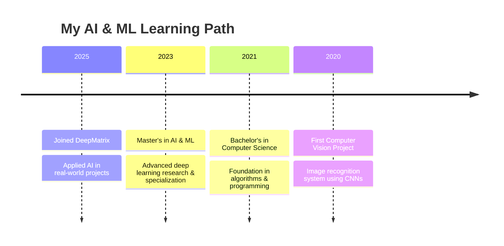

  

## 💼 Professional Profile

I'm an AI Engineer at [DeepMatrix](https://deepmatrix.io) with expertise in computer vision and deep learning. Currently focused on developing cutting-edge solutions for tiny object detection, oriented object detection, and point cloud processing. With a Master's degree in AI & ML, I combine strong theoretical knowledge with practical implementation skills to solve complex real-world problems.

> **"Transforming complex problems into AI-powered solutions"**

- 🎓 **Education**: Master's in AI & Machine Learning
- 🔭 **Focus Areas**: Computer Vision, Deep Learning, 3D Point Cloud Processing
- 💻 **Programming**: Python, C++, C, SQL
- 🌐 **Location**: India

  
## 🤝 Let's Connect

## 🚀 Experience

- **AI Engineer** | [DeepMatrix](https://deepmatrix.io) | *Present*
  - Specializing in tiny object detection and tiny oriented detection algorithms
  - Working with 3D point cloud data processing and analysis
  - Integrating advanced AI technologies into object detection systems
  - Developing computer vision models for real-time detection of small objects
  - Creating efficient edge-compatible detection solutions
  - Collaborating with research teams on next-generation CV technologies

## 💻 Technical Expertise

<b>🧠 AI & Machine Learning</b>

 

|  |  |
|----------|-------------|
| **Deep Learning** |    |
| **Computer Vision** |    |
| **3D Vision & Point Cloud** |    |
| **ML Ops** |    |

<b>🔧 Programming & Tools</b>

 

|  |  |
|----------|-------------|
| **Languages** |     |
| **Data Science** |    |
| **Visualization** |    |
| **Development** |    |

<b>☁️ Cloud & Infrastructure</b>

 

|  |  |
|----------|-------------|
| **Cloud Platforms** |    |
| **Containers & Orchestration** |   |
| **Databases** |    |

## 📚 Education Journey

## 🏆 Achievements

  

## 📈 GitHub Analytics

  
  

## 🎯 Current Focus & Projects

- 🔬 **Research:** Advanced algorithms for tiny object detection and point cloud processing
- 🛠️ **Development:** Building efficient computer vision systems for real-world applications
- 🤖 **Innovation:** Combining 2D and 3D data for enhanced object detection capabilities
- 🌟 **Exploration:** Deep learning approaches for processing sparse point cloud data
- 🔄 **Open to:** Collaborate on innovative computer vision and AI projects

<b>📌 Featured Projects</b>

 

| Project | Description | Technologies |
|---------|-------------|--------------|
| **Tiny Object Detection Framework** | Specialized detection system for small objects in complex environments | YOLOv8, PyTorch, TensorRT |
| **Oriented Object Detection** | Detection framework handling rotated and oriented objects with high precision | Rotated IoU, PyTorch, C++ |
| **Point Cloud Analysis System** | 3D point cloud processing and object segmentation for spatial data | PCL, Open3D, CUDA |
| **Multi-modal Detection** | Integration of 2D image and 3D point cloud data for enhanced detection | PyTorch, C++, CUDA |
| **Edge-Optimized Detection Models** | Lightweight models optimized for deployment on edge devices | TensorFlow Lite, ONNX, OpenVINO |

## 🐍 Contribution Graph

  

 

  

**"The future belongs to those who believe in the beauty of their dreams."**

