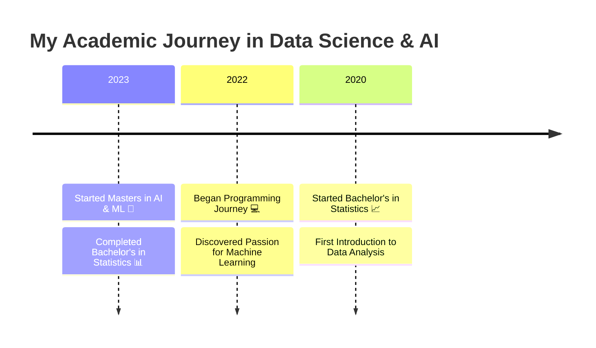

<div align="center">
  
  

  

  <!-- New: Animated Banner -->
  
</div>

<!-- New: Dynamic Badges Section -->
<div align="center">
  
  [](mailto:your.email@gmail.com)
  [](https://www.linkedin.com/in/susanta-baidya-03436628a/)
  [](https://github.com/Susanta2102)
  [](https://www.kaggle.com/susanta21)
  [](https://leetcode.com/u/msa23009_iiitl/)
  
</div>

<h3 align="center">
  🎓 Master's student in AI & ML | 💡 LLM Explorer | 🚀 Problem Solver | 🤖 AI Enthusiast
</h3>

<!-- New: About Me Section with Icons -->
<h2>🚀 About Me</h2>

```python
class AIEngineer:
    def __init__(self):
        self.name = "Susanta"
        self.role = "AI & ML Engineer"
        self.languages = ["Python", "C++", "C"]
        self.interests = ["Deep Learning", "Computer Vision", "LLMs"]
        self.currently_learning = "Transformer Architecture"
        self.fun_fact = "I dream in Python 🐍"

    def say_hi(self):
        print("Thanks for dropping by! Let's build something amazing together!")

me = AIEngineer()
me.say_hi()
```

<!-- New: Animated Stats Cards -->
<div align="center">
  
</div>

<div align="center">
  
  
  
</div>

<!-- New: Animated Skill Bars -->
<h2>💻 Technical Skills</h2>

```text
AI/ML             ███████████████████░   95%
Python            ████████████████████   100%
Deep Learning     ██████████████████░░   90%
Computer Vision   ███████████████████░   95%
Data Science      ██████████████████░░   90%
```

<!-- Existing Sections with New Organization -->
<h2 align="left">🛠️ Tech Stack</h2>

<details>
<summary>🧠 AI/ML & Deep Learning</summary>
<div align="center">

| Category | Technologies |
|----------|-------------|
| Deep Learning Frameworks |   |
| Computer Vision |   |
| Machine Learning |  |
| Data Processing |   |

</div>
</details>

<details>
<summary>📊 Data Engineering & Databases</summary>
<div align="center">

| Category | Technologies |
|----------|-------------|
| Big Data |  |
| Databases |    |

</div>
</details>

<details>
<summary>🔧 Development & DevOps</summary>
<div align="center">

| Category | Technologies |
|----------|-------------|
| Version Control |  |
| Containerization |  |
| Testing |  |
| IDE |   |

</div>
</details>

<!-- New: Current Focus Section -->
<h2>🎯 Current Focus</h2>

<div align="center">
  <table>
    <tr>
      <td align="center">
        
        <br>Deep Learning
      </td>
      <td align="center">
        
        <br>Computer Vision
      </td>
      <td align="center">
        
        <br>Python
      </td>
      <td align="center">
        
        <br>DevOps
      </td>
    </tr>
  </table>
</div>

<!-- New: Education Timeline -->
<h2>📚 Education Journey</h2>




<!-- Existing Stats Section with New Theme -->
<div align="center">
  
</div>

<p align="center">
  
</p>

<div align="center">
  
  
</div>

<!-- New: Contribution Calendar -->
<div align="center">
  
</div>

<!-- New: Footer -->
<div align="center">
  
</div>

<!-- Profile Views Counter -->
<div align="center">
  
</div>
