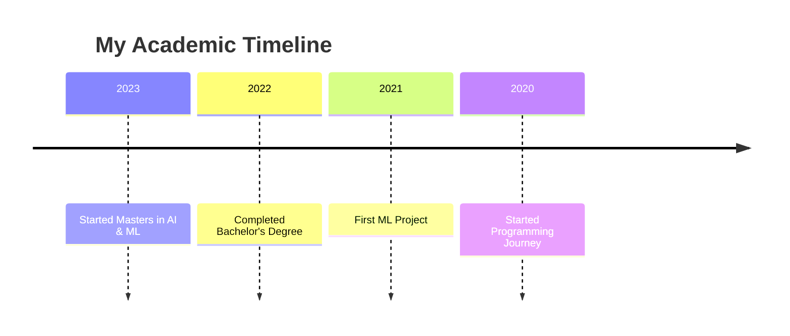

<div align="center">
  
  

  


  <!-- Added: GitHub Trophies -->
  [](https://github.com/ryo-ma/github-profile-trophy)

  <!-- Animated Banner -->
  
</div>

<!-- Dynamic Badges Section -->
<div align="center">
  
  [](mailto:your.email@gmail.com)
  [](https://www.linkedin.com/in/susanta-baidya-03436628a/)
  [](https://github.com/Susanta2102)
  [](https://www.kaggle.com/susanta21)
  [](https://leetcode.com/u/msa23009_iiitl/)
  [](https://x.com/SusantBaidya)
  
</div>

<h3 align="center">
  🎓 Master's student in AI & ML | 💡 LLM Explorer | 🚀 Problem Solver | 🤖 AI Enthusiast
</h3>

<!-- About Me Section with Icons -->
<h2>🚀 About Me</h2>

```python
class AIEngineer:
    def __init__(self):
        self.name = "Susanta"
        self.role = "AI & ML Engineer"
        self.languages = ["Python", "C++", "C"]
        self.interests = ["Deep Learning", "Computer Vision", "LLMs"]
        self.currently_learning = "Transformer Architecture"
        self.fun_fact = "I dream in Python 🐍"

    def say_hi(self):
        print("Thanks for dropping by! Let's build something amazing together!")

me = AIEngineer()
me.say_hi()
```

<!-- Detailed Tech Stack Section -->
<h2 align="left">🛠️ Tech Stack</h2>

<details>
<summary>🐍 Programming Languages</summary>
<div>

| Python3 | C | C++ |
|----------|----------|----------|
|   |   |    |
</div>
</details>

<details>
<summary>🤖 AI/ML Frameworks & Libraries</summary>
<div>

| Pytorch | Selenium | Numpy | Pandas | Sklearn | Matplotlib | OpenCV |
|----------|----------|----------|----------|----------|----------|----------|
|  |  |  |  |  |  | |
</div>
</details>

<details>
<summary>📊 Data Tools</summary>
<div>

| Conda | Jupyter | Spark | MySQL | Postgres | SQLite |
|----------|----------|----------|----------|----------|----------|
|||||||
</div>
</details>

<details>
<summary>🔧 Development Tools</summary>
<div>

| Git | Docker | Pytest | Postman | Virtual Box|
|----------|----------|----------|----------|----------|
||||  ||
</div>
</details>

<!-- Education Timeline -->
<h2>📚 Education Journey</h2>



<!-- Academic Focus -->
<h3 align="left">📚 Academic Focus:</h3>
<div align="left">
  <table>
    <tr>
      <td>🔬 Data Structures and Algorithms</td>
      <td>📊 Database Management Systems</td>
    </tr>
    <tr>
      <td>🧠 Deep Learning</td>
      <td>👁️ Image Vision and Processing</td>
    </tr>
  </table>
</div>

<!-- Stats Section -->
<div align="center">
  
</div>

<p align="center">
  
</p>

<p align="center">
  
  
</p>

<!-- Added: Spotify Now Playing -->
<div align="center">
  
</div>

<!-- Contribution Snake -->
<div align="center">
  
</div>

<!-- Footer -->
<div align="center">
  
</div>

<!-- Profile Views Counter -->
<div align="center">
  
</div>
