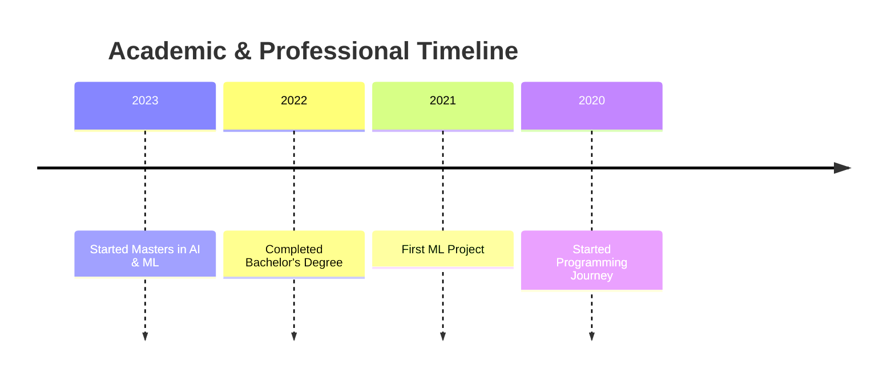

<div align="center">
  
<!-- Dynamic Banner -->


<!-- Animated Name -->
[](https://git.io/typing-svg)

<!-- Profile Views & Social Links -->
<p>
  
  <a href="mailto:your.email@gmail.com">
    
  </a>
  <a href="https://www.linkedin.com/in/susanta-baidya-03436628a/">
    
  </a>
  <a href="https://github.com/Susanta2102">
    
  </a>
  <a href="https://twitter.com/SusantBaidya">
    
  </a>
</p>

<!-- Brief Introduction -->
<h3>🎓 Master's student in AI & ML | 💡 LLM Explorer | 🚀 Problem Solver</h3>

</div>

---

### 👨‍💻 About Me

```python
class AIEngineer:
    def __init__(self):
        self.name = "Susanta"
        self.role = "AI & ML Engineer"
        self.education = {
            "masters": "AI & Machine Learning",
            "bachelors": "Computer Science"
        }
        self.interests = ["Deep Learning", "Computer Vision", "LLMs"]
        self.currently_learning = "Transformer Architecture"
        self.fun_fact = "I dream in Python 🐍"

    def get_current_projects(self):
        return [
            "🤖 Building Custom LLM Applications",
            "🧠 Developing Computer Vision Solutions",
            "📊 Creating ML Pipelines"
        ]

me = AIEngineer()
```

---

### 🚀 Current Focus

- 🔭 Working on **Large Language Models and Computer Vision**
- 🌱 Learning **Advanced Deep Learning Architectures**
- 👯 Looking to collaborate on **AI/ML Open Source Projects**
- 💬 Ask me about **Python, Deep Learning, Computer Vision**
- ⚡ Fun fact: **I can explain complex AI concepts using simple analogies!**

---

### 🛠️ Technical Stack

<details>
<summary>🐍 Programming Languages</summary>


</details>

<details>
<summary>🤖 AI/ML Frameworks</summary>


</details>

<details>
<summary>🛠️ Development Tools</summary>


</details>

---

### 📊 GitHub Stats

<div align="center">
  
[](https://github.com/Susanta2102)


<!-- GitHub Activity Graph -->
[](https://github.com/Susanta2102)

</div>

---

### 🎓 Education Journey



---

### 🏆 Achievements

<!-- GitHub Trophies -->
[](https://github.com/ryo-ma/github-profile-trophy)

---

### 🤝 Let's Connect!

<p align="center">
  <a href="https://linkedin.com/in/susanta-baidya-03436628a">
    
  </a>
  <a href="https://twitter.com/SusantBaidya">
    
  </a>
  <a href="mailto:your.email@gmail.com">
    
  </a>
</p>

<!-- Profile Views Counter -->
<div align="center">
  
</div>

<!-- Footer Wave -->

